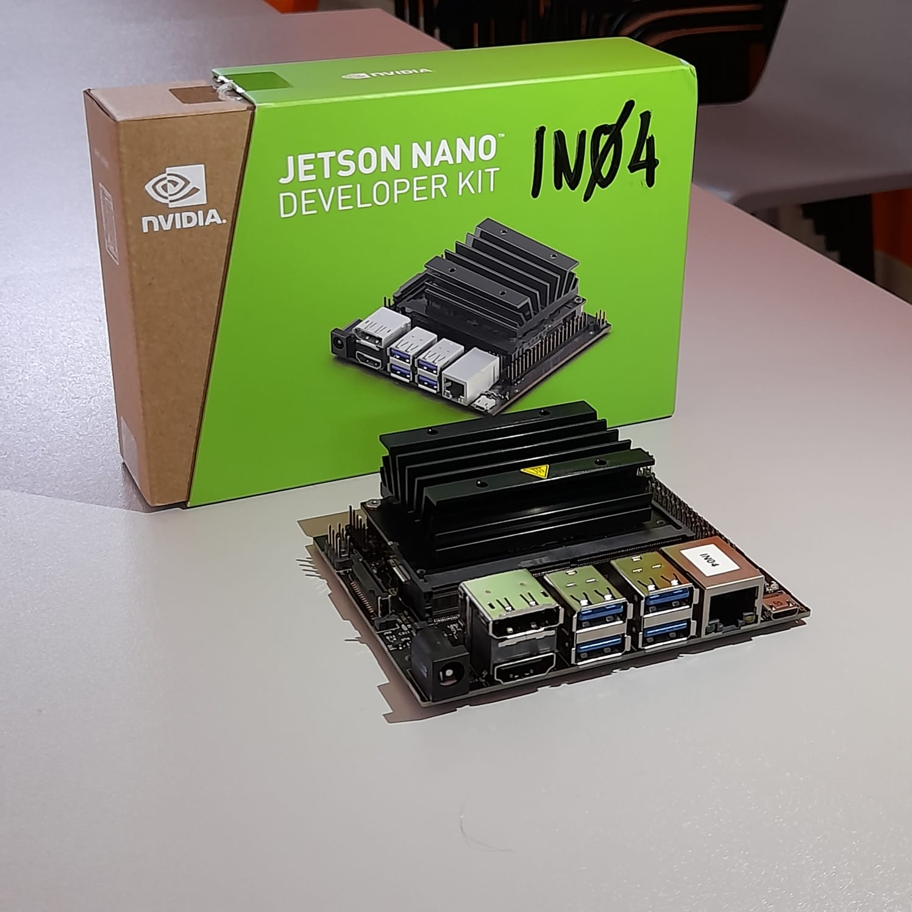
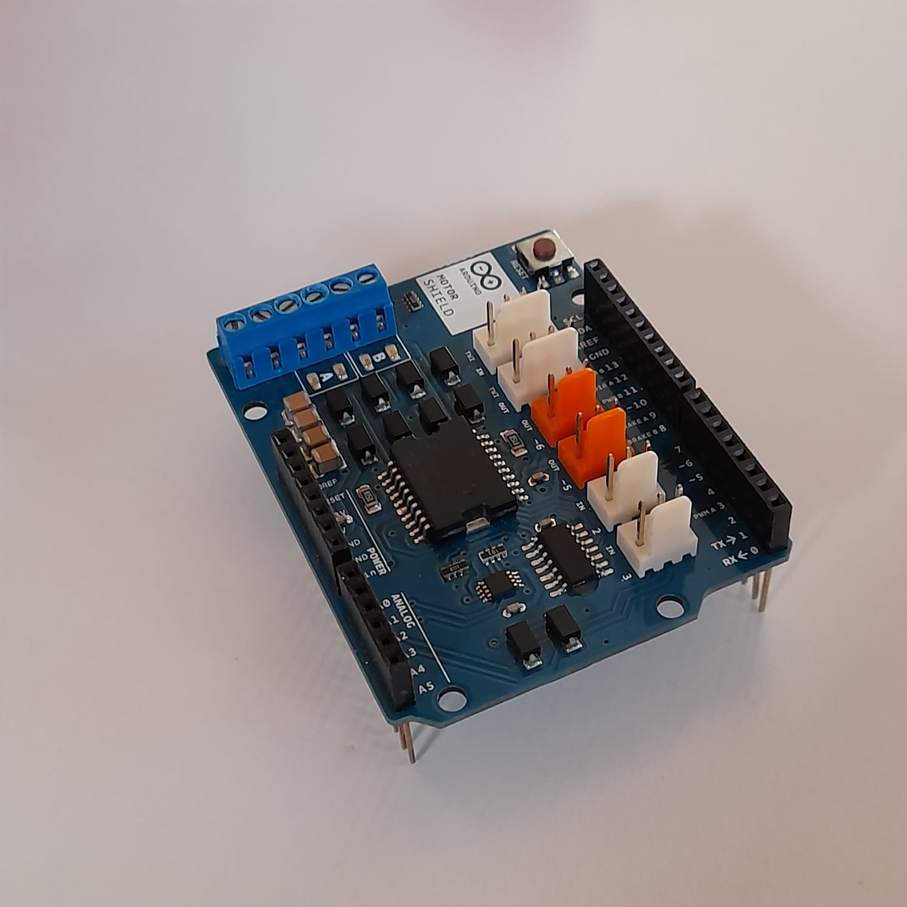
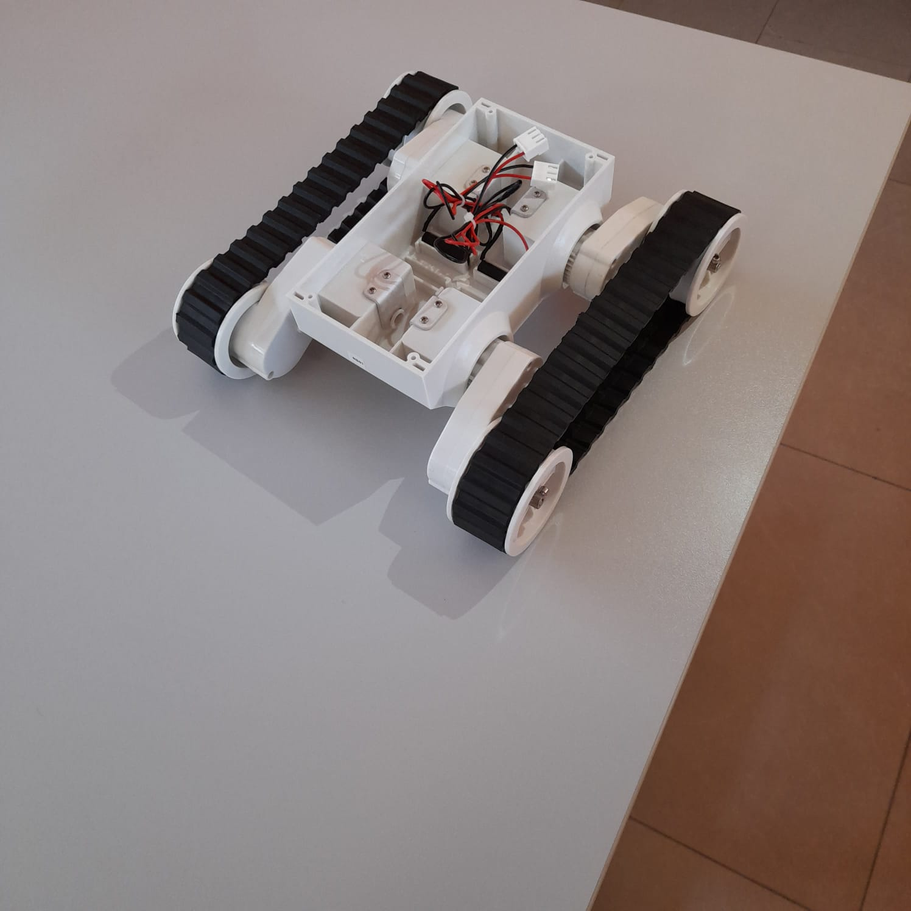

# the starting idea : 

we have started the project thinking to something that can move around and pick up rubbish left in autonomy, without the human presence.

using artificial intelligence, the goal are : 
- make a robot who can recognize the different type of waste
- recognize and avoid correctly the obstacles on the path

# project scheme:

    

# Components:

### Nvidia Jetson Nano:

     

Nvidia Jetson Nano is a particularly powerful processor, capable of supporting an AI algorithm.

### Motor Shield:

  

    An arduino module who manage the motor's input

### Yoda:

    

    Yoda is the robot where we have mounted all the components. 
    We use 2 of the 4 motors built in the tracks

 
